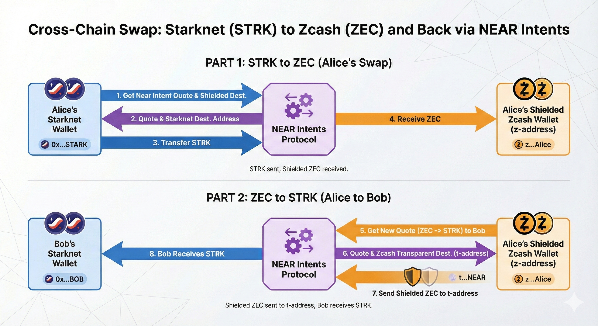

# Lethe


> [!WARNING] > **Proof of Concept Disclaimer**
>
> Lethe is a proof-of-concept (PoC) project. This code is experimental and not production-ready. The developers take no responsibility for any negative effects, losses, or damages that may result from using this code. Use at your own risk.

## Use Case

Zcash offers shielded transactions that provide strong privacy guarantees through zero-knowledge proofs. Lethe leverages this capability to enable privacy on Starknet by bridging transactions through Zcash. This allows users to perform privacy-preserving transfers between Starknet and Zcash, effectively enabling shielded STRK transfers by routing through Zcash's shielded pool.

Lethe serves as a showcase of what can be achieved by integrating three powerful blockchain ecosystems: **Starknet**, **NEAR**, and **Zcash**. By combining Starknet's scalable smart contract platform, NEAR's Intents Protocol for cross-chain swaps, and Zcash's privacy-preserving shielded transactions, Lethe demonstrates how these technologies can work together to create novel privacy solutions.

This proof-of-concept can serve as a foundation for developers to build upon. The integration patterns, architecture, and codebase provide a starting point for creating new applications that leverage cross-chain privacy, including:

- Privacy-preserving DeFi applications
- Cross-chain privacy bridges
- Anonymous payment systems
- Privacy-enhanced token swaps
- Other innovative applications that require transaction privacy across multiple chains

Developers can use Lethe as a reference implementation and extend it with additional features, integrations, or use cases that combine the strengths of these three ecosystems.

## How It Works

Lethe implements an embedded Zcash wallet that supports only shielded transactions. It integrates with the NEAR Intents Protocol to facilitate swaps between STRK (Starknet tokens) and ZEC (Zcash tokens) in both directions. This integration enables users to:

- Convert STRK to ZEC and receive it in a shielded Zcash address
- Convert ZEC back to STRK, routing through Zcash's shielded pool for privacy
- Facilitate shielded STRK transfers by going through Zcash, breaking the linkability of transactions on Starknet

## Step-by-Step Flow

The Lethe system operates in two main flows:

### Part 1: STRK to ZEC (Alice's Swap)

1. **Get Quote & Destination**: Alice's Starknet wallet requests a quote from the NEAR Intents Protocol and provides a shielded Zcash destination address
2. **Receive Quote**: The NEAR Intents Protocol returns a quote and a Starknet destination address
3. **Transfer STRK**: Alice transfers STRK from her Starknet wallet to the NEAR Intents Protocol
4. **Receive ZEC**: Alice receives ZEC in her shielded Zcash wallet (z-address)

**Result**: STRK sent, Shielded ZEC received.

### Part 2: ZEC to STRK (Alice to Bob)

5. **Get New Quote**: Alice requests a new quote from her shielded Zcash wallet to convert ZEC to STRK, specifying Bob as the recipient
6. **Receive Quote & Transparent Address**: The NEAR Intents Protocol returns a quote and a Zcash transparent destination address (t-address) on the NEAR network
7. **Send Shielded ZEC**: Alice sends shielded ZEC from her z-address to the transparent t-address
8. **Bob Receives STRK**: Bob receives STRK in his Starknet wallet

**Result**: Shielded ZEC sent to t-address, Bob receives STRK.



## Wallet Operation Details

The design philosophy behind Lethe's wallet is to eliminate the need for users to download and set up an additional wallet application. To achieve this, an ephemeral Zcash wallet is automatically created in the browser when needed. The wallet details (including the seed phrase and wallet state) are stored in the browser's local storage (IndexedDB). This ephemeral wallet is used to receive and transfer ZEC during the swap process.

The Lethe wallet operates with the following characteristics:

- **Browser-Generated**: The wallet is generated in the browser on first use. A seed phrase is created and stored locally.
- **Session Persistence**: The wallet can persist between browser sessions using IndexedDB storage, but you should **not rely on it** for long-term fund storage.
- **Storage Limitations**: The wallet keys will be removed if:
  - Browser cache is cleared
  - You are using incognito/private browsing mode
  - Browser storage is cleared by the user or browser
- **Typical Use Case**: The intended use case is to start with 0 ZEC and end with 0 ZEC. Users typically convert STRK → ZEC → STRK in a single session, using Zcash as a privacy-enhancing intermediary rather than a long-term storage solution.

## Acknowledgments

Lethe is built on top of [WebZjs](https://github.com/ChainSafe/WebZjs), a JavaScript client library for building Zcash browser wallets developed by ChainSafe. This would not have been possible withouth t.

## Build Instructions

### Prerequisites

Before building Lethe, ensure you have the following installed:

- **Rust**: Rust nightly-2025-01-07 (specified in `rust-toolchain.toml`)
  - Install from [rustup.rs](https://rustup.rs/)
- **wasm-pack**: Required for building WebAssembly modules
  - Install from [wasm-pack](https://rustwasm.github.io/wasm-pack/installer/)
- **just**: Command runner used for build scripts
  - Install from [just](https://github.com/casey/just)
- **clang**: Version 17 or later
  - On macOS: Update LLVM using your preferred package manager (e.g., Homebrew, MacPorts)
  - On Linux: Install via your distribution's package manager
- **Node.js**: Version 18.18.0 or later
  - Install from [nodejs.org](https://nodejs.org/)
- **yarn**: Version 4.5.1 (specified in `package.json`)
  - Install from [yarnpkg.com](https://yarnpkg.com/getting-started/install)

### Building

1. **Build WebAssembly packages**:

   ```shell
   just build
   ```

   This builds the `webzjs-wallet`, `webzjs-keys`, and `webzjs-requests` packages.

2. **Install JavaScript dependencies**:

   ```shell
   yarn
   ```

3. **Build the web wallet**:
   ```shell
   yarn build
   ```
   Or alternatively:
   ```shell
   yarn web-wallet:build
   ```

## Running Instructions

To run Lethe in development mode:

```shell
yarn dev
```

Or:

```shell
yarn web-wallet:dev
```

Alternatively, you can navigate to the web-wallet directory and run:

```shell
cd packages/web-wallet
yarn dev
```

This will start a local development server where you can access the Lethe wallet interface.

> [!WARNING] > **Security Warning**
>
> This code has not been audited and is provided as-is with no guarantees. The software may contain bugs, security vulnerabilities, or other issues that could result in loss of funds or other negative consequences. Use at your own risk and do not store significant funds in this wallet.

## License

All code in this workspace is licensed under either of

- Apache License, Version 2.0, ([LICENSE-APACHE](LICENSE-APACHE) or http://www.apache.org/licenses/LICENSE-2.0)
- MIT license ([LICENSE-MIT](LICENSE-MIT) or http://opensource.org/licenses/MIT)

at your option.

### Contribution

Unless you explicitly state otherwise, any contribution intentionally
submitted for inclusion in the work by you, as defined in the Apache-2.0
license, shall be dual licensed as above, without any additional terms or
conditions.
